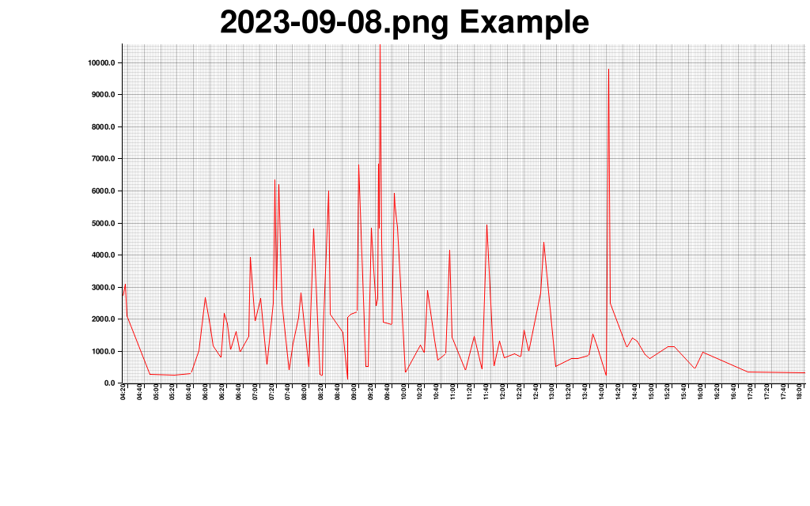

# plotter
logs plotter


Example of usage:
```
cargo run -- --help
cargo run -- --title "Example"  --filter Created --filter /transactions --filter <function name> -s 60 -- /logs_dir/*.log
```

Outcome:


